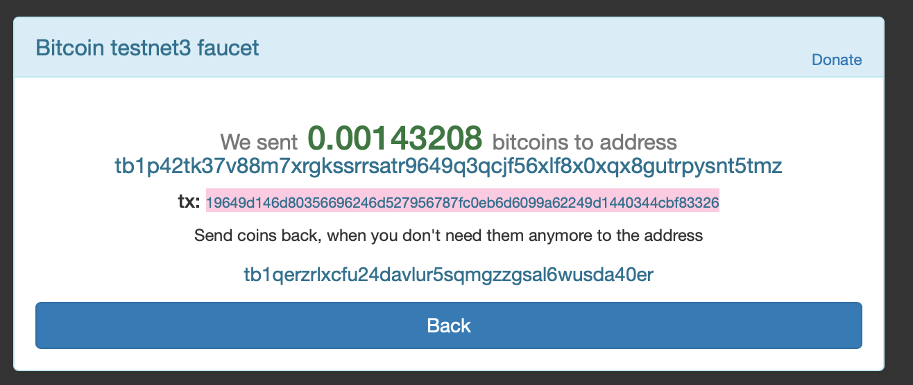
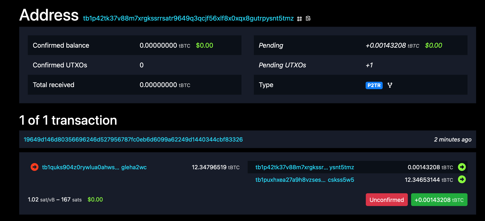
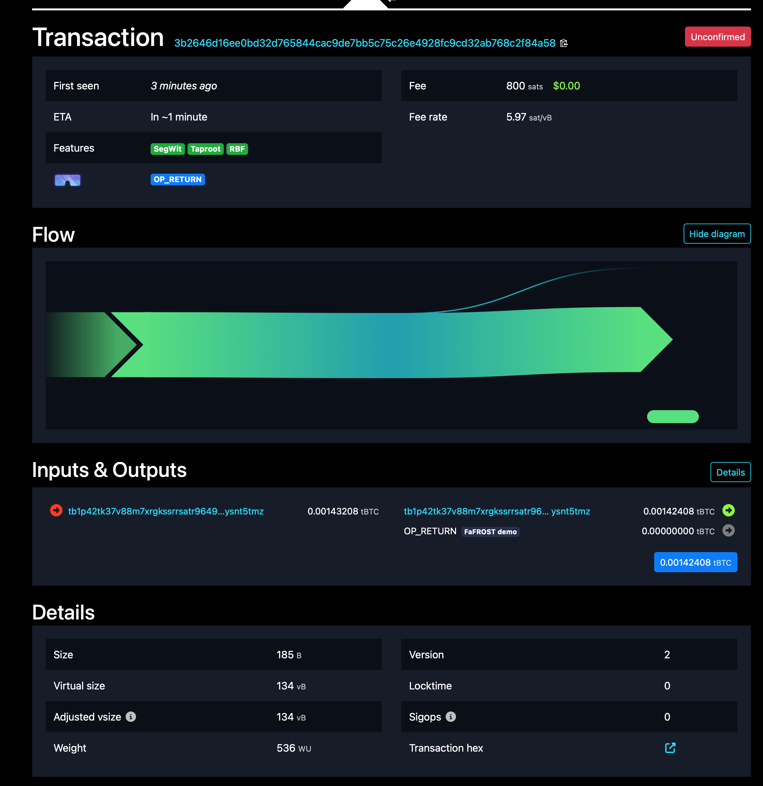

# FaFROST Bitcoin Testnet Demo

To demonstrate end-to-end compatibility with Bitcoin, we constructed and broadcast a Taproot key-spend transaction using FaFROST. The binaries under `src/bin/` reproduce each step and instantiate the `Secp256k1Bip340` ciphersuite.

The Bitcoin binaries require the `bitcoin-demo` Cargo feature (they pull in the `bitcoin` and `bitcoin_hashes` crates, which are CC0-1.0 and kept out of the default build). Run all commands from the repository root. This folder holds the historical key file (`fafrost-key.yaml`) that produced the transaction below, plus the testnet screenshots.

## Steps

**Generate a threshold key** (2-of-3):

```
cargo run --bin keygen -- bitcoin-demo/fafrost-key.yaml 3 2
```

**Derive a Taproot address** from the key file:

```
cargo run --features bitcoin-demo --bin generateaddress -- bitcoin-demo/fafrost-key.yaml testnet
```

**Construct and sign a testnet transaction:**

```
cargo run --features bitcoin-demo --bin spenddemo -- \
  bitcoin-demo/fafrost-key.yaml \
  19649d146d80356696246d527956787fc0eb6d6099a62249d1440344cbf83326 \
  0 \
  143208 \
  800
```

The arguments are: key file, input TXID, vout, input amount (sat), fee (sat). This produces a raw transaction that can be broadcast via any public Bitcoin testnet explorer or a local node. `spenddemo` re-verifies its own output with `bip340_verify_bytes` before printing the transaction.

> Regenerating `fafrost-key.yaml` produces a fresh random key (and hence a different address), so the historical transaction below corresponds to the key that was in the repository at broadcast time.

## The broadcast transaction

The originally broadcast transaction spent UTXO `19649d146d80356696246d527956787fc0eb6d6099a62249d1440344cbf83326:0` and produced a valid BIP-340 Schnorr signature accepted by the Bitcoin network. The raw transaction was:

```
020000000001012633f8cb440344d14922a699606debc07f785679526d24966635806d149d64190000000000fdffffff02482c020000000000225120aa9768f9873efc61a2d080c70eac65d54a0883124d346fa4e6798063a38b184900000000000000000e6a0c466146524f53542064656d6f0140b817e4a4d9b673e5255ea2b98fe2e711d00c8df5d42951d2ee43eda8803ace234fe2ee793055b08e8de66f28670021c0d339128fd300ce9f1309b216c95d75e100000000
```

It includes an `OP_RETURN` output with the string `"FaFROST demo"` for easy identification:

https://mempool.space/testnet/tx/3b2646d16ee0bd32d765844cac9de7bb5c75c26e4928fc9cd32ab768c2f84a58

## Screenshots

Funding the Taproot address from a testnet faucet:



The funding transaction confirmed on-chain:



The FaFROST-signed key-spend transaction:


